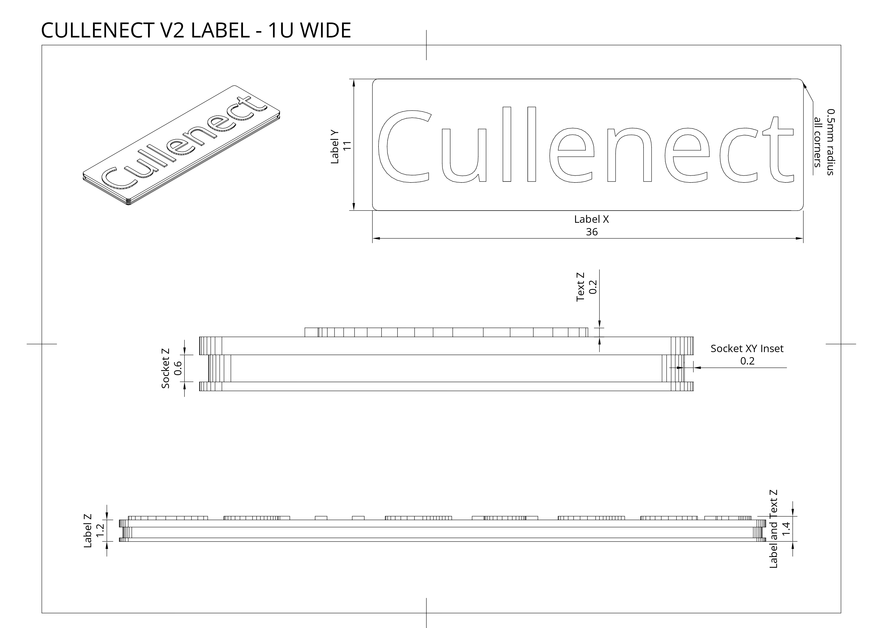
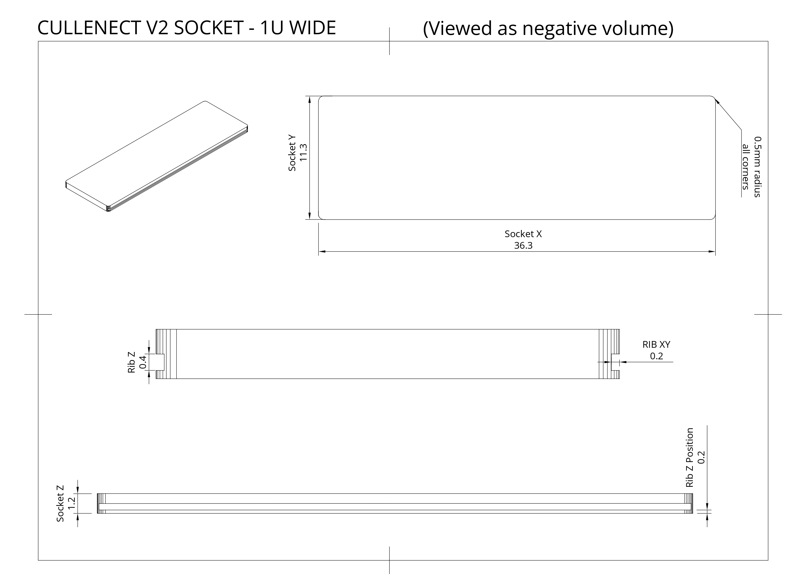

# Cullenect Labels
A standardized system of swappable 3D printed labels for Gridfinity and more. Thin and efficient labels with a satisfying *click* when inserted into a slot. 

## Related and Helpful Repositories
* [Cullenect Labels](https://makerworld.com/en/models/446624) <- You are here.
* [gflabel by ndevenish](https://github.com/ndevenish/gflabel/) - A Python script to generate labels. Easy to automate and customize, supports many hardware and electronic icons.
* [Gridfinity Extended by ostat](https://github.com/ostat/gridfinity_extended_openscad) - A fork of Gridfinity with additional features and improvement. Generate bins with built in slots for Cullenect labels.

## Contributors
Thank you for the feedback and collaboration.

* [ndevenish](https://github.com/ndevenish/)
* [osts](https://github.com/ostat/)

## Standards and Dimensions - Gridfinity
Labels and sockets can be adapted to any size of bin. Custom label sizes are possible but these are the recommended dimensions:

### Label dimensions:
Labels feature a latch carved out of the entire perimeter of the label, allowing for socket ribs along either axis to hold the label in place.

* Label X (width): (42mm * Gridfinity_Units) - 6mm
  * Example: 1U = 36mm, 2U = 78mm, 3U = 120mm
* Label Y (height): 11mm
* Label Z (depth): 1.2mm
* Text Z (depth): 0.2mm (emboss or deboss)
* Label Latch XY inset: 0.2mm around the entire perimeter of the label
* Label Latch Z (depth): 0.6mm
* Label Latch Z Position: 0.2mm from the bottom of the label

### Socket dimensions:
Sockets feature ribs along the X axis on boths sides of the socket to hold the label in place.

* Socket XY offset: 0.3mm
* Socket X: label_x + offset
  * Example: label_x = 36mm, socket_x = 36.3mm
* Socket Y: label_y + offset
  * Example: label_y = 11mm, socket_y = 11.3mm
* Socket Z (depth): 1.2mm
* Socket Rib XY: 0.2mm
* Socket Rib Z (depth): 0.4mm
* Socket Rib Z Position: 0.2mm from the bottom of the socket

