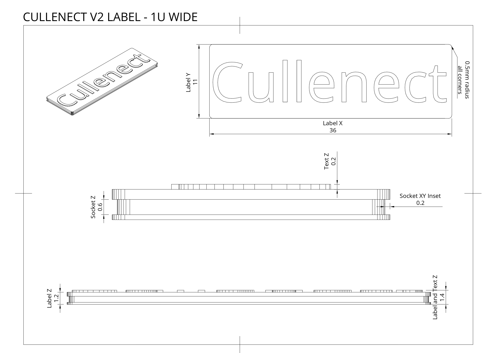
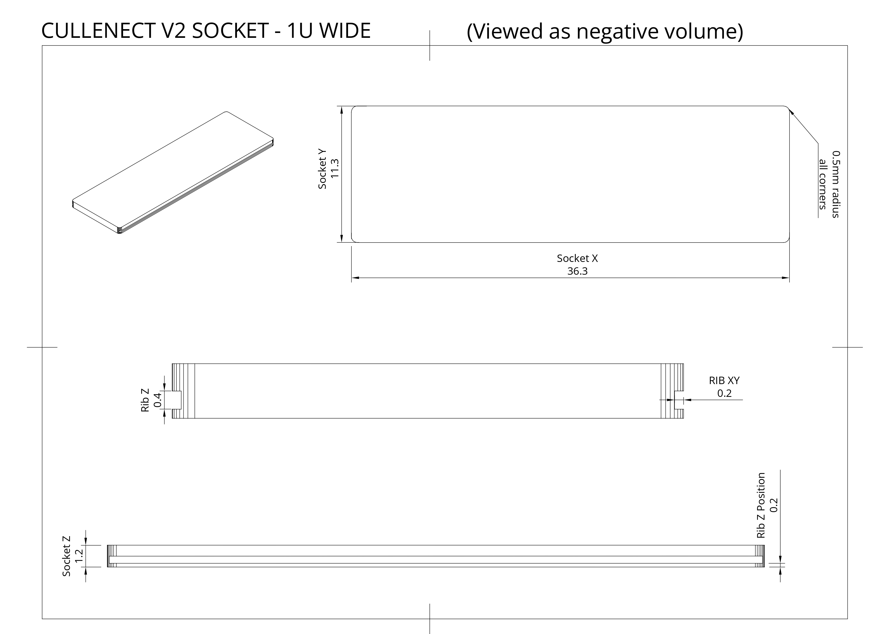

# Cullenect Labels

A standardized system of swappable 3D printed labels for Gridfinity and more. Thin and efficient labels with a satisfying *click* when inserted into a slot.

## Related and Helpful Repositories
* [Cullenect Labels On Makerworld](https://makerworld.com/en/models/446624) - Pre sliced profiles for various hardware. Makeworld Customizer better supports color than vanilla OpenSCAD (for now).
* [gflabel by ndevenish](https://github.com/ndevenish/gflabel/) - A Python script to generate labels. Easy to automate and customize, supports many hardware and electronic icons.
* [Gridfinity Extended by ostat](https://github.com/ostat/gridfinity_extended_openscad) - A fork of Gridfinity with additional features and improvement. Generate bins with built in slots for Cullenect labels.

## Contributors
Thank you for the feedback and collaboration.

* [ndevenish](https://github.com/ndevenish/)
* [osts](https://github.com/ostat/)

---

## Configuration & Usage

This project uses OpenSCAD and provides a comprehensive set of options to customize your labels. You can generate labels manually via the OpenSCAD Customizer or automate the process using the included Python script.

### OpenSCAD Options (Customizer)

#### General Settings
*   **Select_Output**: Choose what to render.
    *   `Label`: The standard label.
    *   `Label Spacer`: A blank spacer.
    *   `Socket Test Fit`: Test print for socket dimensions.
    *   `Socket Negative Volume`: Negative volume to subtract from other models.
    *   `Vertical Socket...`: Variants for vertical printing.
*   **label_width**: Width of the label in Gridfinity units (default: 1).
*   **backward_compatible**: Generate V1 latches for 1U bins (True/False).
*   **label_surface**: Text style. `Emboss` (raised), `Deboss` (sunken), `Flush` (flat, for multi-color printing).
*   **Text_Color**: Hex code for text/icon color (e.g., `#333333`).

#### Label Text 1 & 2
*   **Text1 / Text2**: The actual text content.
*   **Text1_Align / Text2_Align**: Alignment (`left`, `center`, `right`).
*   **Text1_Font_Size / Text2_Font_Size**: Font size in mm.
*   **Text1_Font**: Font family (e.g., `Open Sans`, `Ubuntu`).
*   **Text1_Font_Style**: Font style and weight (e.g., `Regular`, `Bold`).
*   **Text1_XY / Text2_XY**: Manual X/Y position adjustment `[x, y]`.

#### Fastener Icon
*   **Show_Fastener**: Enable or disable the fastener icon.
*   **Fastener_Head**: Head type (`socket`, `countersunk`, `roundh`, `pan`).
*   **Fastener_Shaft**: Shaft type (`machine`, `tapping`).
*   **Fastener_Threads**: Thread detail (`full`, `partial`, `none`).
*   **Fastener_Driver**: Driver type (`phillips`, `hex`, `torx`, `slot`, etc.).
*   **Fastener_Head_Flange**: Add a flange to the head (True/False).
*   **Fastener_Driver_Security**: Add a security pin to the driver (True/False).
*   **Fastener_View**: **[NEW]** Select view angle.
    *   `side`: Traditional side profile.
    *   `top`: Head-on view (circular).

#### Hardware Icon
*   **Select_Hardware**: Add a secondary hardware icon. Options include:
    *   `washer`, `washer_locking`
    *   `threaded_insert`
    *   `nut`, `nut_square`, `nut_nylon`
    *   `tnut_1` (Side), `tnut_2` (Top)
    *   `magnet`
    *   `crimp_...` (Various crimp connectors: ring, fork, spade, receptacle)

---

### Automated Generation (Python)

Batch generate multiple labels using `OpenSCAD/generate_models.py`.

#### Setup
1.  Ensure you have OpenSCAD installed.
2.  Define your label configurations in JSON files inside `OpenSCAD/configs/`.

#### JSON Configuration Example
Create a file like `OpenSCAD/configs/my_label.json`:
```json
{
    "filename": "Label_Custom_M3",
    "vars": {
        "Text1": "M3",
        "Select_Hardware": "washer",
        "Text_Color": "#FF0000",
        "Fastener_View": "top",
        "Show_Fastener": "true"
    }
}
```

#### Running the Script
Run the script from the `OpenSCAD` directory:
```bash
python generate_models.py [options]
```

**Options:**
*   `--format [fmt]`: Output format (`stl`, `3mf`, `step`, etc.). Default is `stl`.
*   `--jobs [n]`: Number of parallel jobs. Defaults to CPU core count.

---

## Standards and Dimensions - Gridfinity
Labels and sockets can be adapted to any size of bin. Custom label sizes are possible but these are the recommended dimensions:

### Label dimensions:
Labels feature a latch carved out of the entire perimeter of the label, allowing for socket ribs along either axis to hold the label in place.

* Label X (width): (42mm * Gridfinity_Units) - 6mm
  * Example: 1U = 36mm, 2U = 78mm, 3U = 120mm
* Label Y (height): 11mm
* Label Z (depth): 1.2mm
* Text Z (depth): 0.2mm (emboss or deboss)
* Label Latch XY inset: 0.2mm around the entire perimeter of the label
* Label Latch Z (depth): 0.6mm
* Label Latch Z Position: 0.2mm from the bottom of the label



### Socket dimensions:
Sockets feature ribs along the X axis on boths sides of the socket to hold the label in place.

* Socket XY offset: 0.3mm
* Socket X: label_x + offset
  * Example: label_x = 36mm, socket_x = 36.3mm
* Socket Y: label_y + offset
  * Example: label_y = 11mm, socket_y = 11.3mm
* Socket Z (depth): 1.2mm
* Socket Rib XY: 0.2mm
* Socket Rib Z (depth): 0.4mm
* Socket Rib Z Position: 0.2mm from the bottom of the socket


